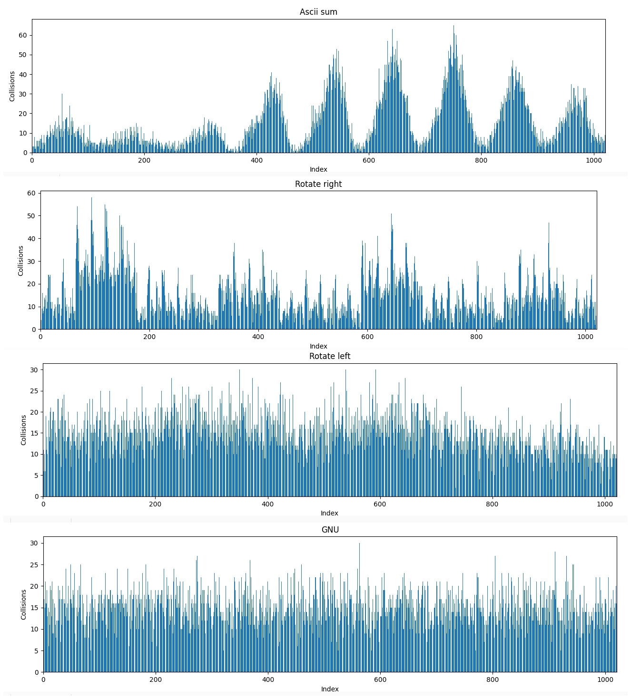

# Отчёт по работе Хэш Таблицы

## Введение

**Хэш-функция** - функция, преобразующая произвольный массив входных данных в битовую строку установленной длины. Подобное преобразование называется **хешированием**.

**Хэш-таблица** - структура данных, реализующая интерфейс ассоциативного массива (все элементы хранятся в виде пары ключ-значение). Она позволяет выполнять три операции: добавление новой пары, удаление пары и поиск пары по ключу.

Выполнение каждой операции в хеш-таблице начинается с вычисления хеш-функции от ключа. Хеш-код $i = hash(key)\%TAB_{SIZE}$ играет роль индекса в массиве `H`. В дальнейшем пару ключ-значение помещают в ячейку`H[i]`.

**Общая схема хэш таблиц для массива `H`:**


Помимо массива с открытой адресацией есть вариант хэш-таблицы со списками. В таком случае каждая ячейка массива хранит список элементов. Такая реализация необходима в случае возникновения **коллизий**, т.е. совпадения хэша от двух различных ключей. *Мы будем применять её для работы со строками.* 

Основные характеристики хэш-таблиц:

**Заселённость**(Число коллизий) - это длина списка. В хэш-таблице с открытой адресацией данная характеристика не имеет смысла, т.к. рана 1 для каждого `H[i]`.

**Коэффициент заполнения(a)** - число элементов в хэш-таблице, делённое на её размер. Коэффициент заполнения определяет среднее время поиска по хэш-таблице. Для идеальной хэш-функции коэффициент заполнения равен средней длине списка.

## Цель работы

Изучение хэш-таблиц и освоение передовых методов оптимизации.

## План работы

Создать хэш-таблицу на основе списков из строк, а затем произвести следующие исследования:

1. Сравнить работу различных хэш-функций. Для этого построить гистограммы заселённости и посчитать дисперсию для каждого случая. Как итог оставить наилучшую хэш-функцию. 
2. Оптимизировать время поиска по хэш-таблице. Для этого использовать статистику вызова функций от утилиты `kachegrind`. Для чаще всего используемых функций провести оптимизацию ассемблерными вставками и `SIMD`-инструкциями.

## Экспериментальная установка

Ноутбук **Lenovo ThinkPad E14 Gen 2**.

## Использованные утилиты

- Библиотека `mathplotlib` в `Python` для построения гистограмм.
- Инструмент `--callgrind`, утилита `valgrind` с использованием визуализатора `kcachegrind`.
- Ассемблерная команда `rdtsc` для измерения времени

## Исходные данные

Трилогия Дж. Р. Р. Толкиена "Властелин Колец" на английском. После обработка количество уникальных слов получилось равным `15410`.

## Часть 1. Исследование хэш-функций

### Размер хэш-таблицы

Для начала выберем размер таблицы(`TAB_SIZE`) таким образом, чтобы коэффициент заполнения(`a`) получился равен `15`. 

$a = \frac{WORDS_{NUMBER}}{TAB_{SIZE}} ->  TAB_{SIZE} = \frac{WORDS_{NUMBER}}{a} =  \frac{1540}{15} ≈ 1021$

Также необходимо размер таблицы округлить до простого числа, чтобы при вычислении хэш-кода `i` не возникло дополнительных коллизий. Например, если выполняются условия:
+ $hash(key_1) = hash(key_2)*C$ 
+ $hash(key_1) > TAB_{SIZE}$ 
+ $TAB_{SIZE}  ⁞  С$

то $i_1 = i_2$
, что означает коллизию.

1. ### Const хэш

Функция всегда возвращает 2.

```C++
__uint32_t hash_const(const char * string)
{
    return 2;
}
```
Заселённость хэш-таблицы с const хэш:
<details>


</details>


2. ### Strlen хэш

Функция возвращает длину строки.

```C++
__uint32_t hash_strlen(const char * string)
{
    // ASSERT_ASS(string);
    return (__uint32_t)strlen(string);
}
```
Заселённость хэш-таблицы с strlen хэш:
<details>


</details>

3. ### Хэш-первая буква

Функция возвращает первый байт строки.

```C++
__uint32_t hash_first_letter(const char * string)
{
    return (__uint32_t)string[0];
}
```
Заселённость хэш-таблицы с const-хэш:
<details>


</details>

4. ### Хэш-сумма

Функция возвращает сумму ASCII кодов символов.

```C++
__uint32_t hash_ascii_sum(const char * string)
{
    __uint32_t result = 0;
    int idx = 0;

    for(;string[idx] != '\0'; idx++)
        result += string[idx];

    return result;
}
```

Заселённость хэш-таблицы с Ascii sum-хэш:

<details>


</details>

5. ### ROR-хэш

Функция основана на алгоритме циклического сдвига вправо.

```C++
static inline __uint32_t ror(__uint32_t original, __uint32_t bits)  
{
    return (original >> bits) | (original << (32 - bits));

}

__uint32_t hash_rotate_right(const char *string)
{
    __uint32_t hash = 0;
    
    while(*string)
    {
        hash = ror(hash, 1)^*(string++);
    }

    return hash;
}
```

Заселённость хэш-таблицы с ROR-хэш:

<details>


</details>

6. ### ROL-хэш

Функция основана на алгоритме циклического сдвига влево.

```C++
static inline __uint32_t rol(__uint32_t original, __uint32_t bits)  
{
    return (original << bits) | (original >> (32 - bits));
}

__uint32_t hash_rotate_left(const char *string)
{
    __uint32_t hash = 0;
    
    while(*string)
    {
        hash = rol(hash, 1)^*(string++);
    }

    return hash;
}
```

Заселённость хэш-таблицы с ROR-хэш:

<details>


</details>

7. ### GNU-хэш

```C++
__uint32_t hash_gnu(const char *string)
{
    __uint32_t hash = 1021;         // стартовый размер таблицы

    int idx = 0;

    for(;string[idx] != '\0'; idx++)
        hash = ((hash << 5) + hash) + string[idx];

    return hash;
}
```

Заселённость хэш-таблицы с GNU хэш:

<details>


</details>

### Сравнение дисперсии хэш-функций


Для худшей хэш-функции `const_hash`, дисперсия составила $\sigma \approx \sqrt{WORDS_{NUMBER}}$.

Функции `strlen_hash` и `first_letter_hash` оказались не сильно лучше прежде всего из-за их ограниченности. `Strlen_hash` принимает значения от `1` до `16`, а `first_letter_hash` всего `66` значений, соответствующих ASCII-кодам маленьких и больших букв английского алфавита.

Построим новую гистограмму отдельно для 4 других функций:


Т.к. дисперсии последних четырёх функций довольно хорошие, то следует сравнить графики заселённостей. Чем равномернее распределена заселённость, тем меньше будет время среднее выполнения одной операции с хэш-таблицей.



<!-- 
|**Hash func**|**$\sigma$**|
| :--------: |:---:|
| Ascii sum  |13.17|
|Rotate right| 9.67|
| Rotate left| 4.54|
|     GNU    | 4.04| -->

### Вывод

Наилучшими хэш-функциями по распределению заселённости и дисперсии оказались функции `GNU_hash` и `Rotate_right`. 

В дальнейшем используем функцию `GNU_hash` как более компактную в ассемблерной нотации.

## Часть 2. Оптимизация поиска по хэш-таблице

### Задание

Оптимизировать время поиска слова в хэш-таблице. Для этого использовать все испробованные методы оптимизации, уменьшить скорость работы программы на Си.

### Особенности работы

1. Количество слов, используемых в хэш-таблице, уменьшилось до `9430`. Слова длиной больше `8` были удалены, чтобы оставить возможность оптимизировать программу с функцией `__strcmp_avx_2()`.

2. Размер таблицы был подобран так, чтобы коэффициент заполнения составил `1.5`. Т.е. `TAB_SIZE = 6287`

3. Чтобы получить объективную статистику по времени поиска слова, проведём `1000` тестов. Слова для этих тестов подберём так: 
*половину добавим из Властелина Колец, на котором основана хэш-таблица, и половину из Гамлета.*

4. При каждом тесте будем:
    + Если номер теста чётный - ищем слово из Толкиена, если нечётный, то из Шекспира. 
    + Измерять время поиска(`time_interval`) с помощью двух ассемблерной команды `rdtsc`(Read Time Stamp Counter).
    + Вычислять время по этой формуле: `time_average += time_interval/number_of_tests`.
<!-- 

#### Простейший алгоритм

#### Оптимизированный алгоритм

#### Погрешности измерений

#### Измерения

### Часть 2. Alpha Blending

#### Теоретическая справка

#### Простейший алгоритм

#### Оптимизированный алгоритм

#### Погрешности измерений

#### Измерения -->

## Результаты

## Источники и литература