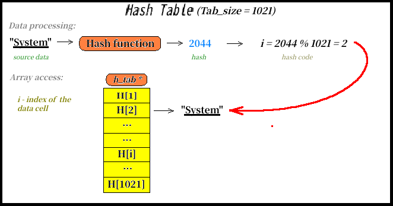
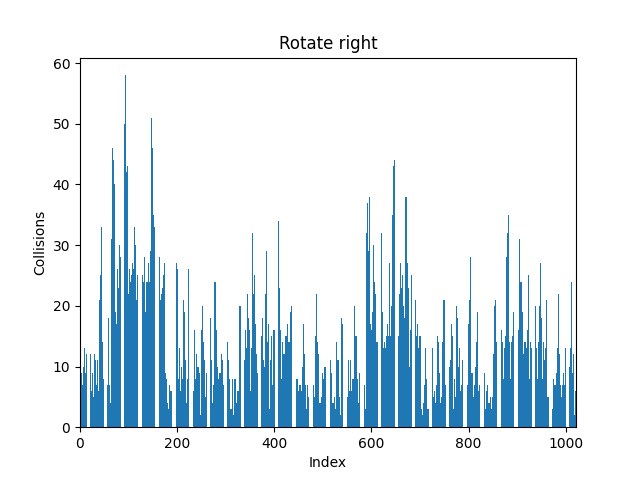

# Отчёт по работе Хэш Таблицы

## Введение

**Хэш-функция** - функция, преобразующая произвольный массив входных данных в битовую строку установленной длины. Подобное преобразование называется **хэшированием**.

**Хэш-таблица** - структура данных, реализующая интерфейс ассоциативного массива (все элементы хранятся в виде пары ключ-значение). Она позволяет выполнять три операции: добавление новой пары, удаление пары и поиск пары по ключу.

Выполнение каждой операции в хэш-таблице начинается с вычисления хэша от ключа. Полученное число отвечает за индекс ячейки `H[i]` массива, куда попадёт пара. $i = hash(key)\%TAB_{SIZE}$ .

**Общая схема хэш таблиц для массива `H`:**


Существуют реализации хэш-таблиц со списками и с открытой адресацией. Рассмотрим вариант со списками, т.к. он допускает попадание нескольких пар в одну ячейку массива `H` - **коллизию**.

Основные характеристики хэш-таблиц:

**Заселённость**(Число коллизий) - это длина списка. В хэш-таблице с открытой адресацией данная характеристика не имеет смысла, т.к. рана 1 для каждого `H[i]`.

**Коэффициент заполнения(a)** - число элементов в хэш-таблице, делённое на её размер. Коэффициент заполнения определяет среднее время поиска по хэш-таблице. Для идеальной хэш-функции коэффициент заполнения равен средней длине списка.

## Цель работы

Изучение хэш-таблиц и освоение передовых методов оптимизации.

## План работы

Создать хэш-таблицу на основе списков из строк, а затем произвести следующие исследования:

1. Сравнить работу различных хэш-функций. Для этого построить гистограммы заселённости и посчитать дисперсию для каждого случая. Как итог оставить наилучшую хэш-функцию. 
2. Оптимизировать время поиска по хэш-таблице. Для этого использовать статистику вызова функций от утилиты `kachegrind`. Для чаще всего используемых функций провести оптимизацию ассемблерными вставками и `SIMD`-инструкциями.

## Экспериментальная установка

Ноутбук **Lenovo ThinkPad E14 Gen 2**.

## Использованные утилиты

- Библиотека `mathplotlib` в `Python` для построения гистограмм.
- Инструмент `--callgrind`, утилита `valgrind` с использованием визуализатора `kcachegrind`.
- Ассемблерная команда `rdtsc` для измерения времени

## Исходные данные

Трилогия Дж. Р. Р. Толкиена "Властелин Колец" на английском. После обработка количество уникальных слов получилось равным `15410`.

## Часть 1. Исследование хэш-функций

### Размер хэш-таблицы

Для начала выберем размер таблицы(`TAB_SIZE`) таким образом, чтобы коэффициент заполнения(`a`) получился равен `15`. 

$a = \frac{WORDS_{NUMBER}}{TAB_{SIZE}} ->  TAB_{SIZE} = \frac{WORDS_{NUMBER}}{a} =  \frac{1540}{15} ≈ 1021$

Также необходимо размер таблицы округлить до простого числа, чтобы при вычислении хэш-кода `i` не возникло дополнительных коллизий. Например, если выполняются условия:
+ $hash(key_1) = hash(key_2)*C$ 
+ $hash(key_1) > TAB_{SIZE}$ 
+ $TAB_{SIZE}  ⁞  С$

то $i_1 = i_2$
, что означает коллизию.

### 1. Const хэш

Функция всегда возвращает 2.

```C++
__uint32_t hash_const(const char * string)
{
    return 2;
}
```
<details>
<summary> Заселённость хэш-таблицы с const-хэш:</summary>


</details>


### 2. Strlen хэш

Функция возвращает длину строки.


```C++
__uint32_t hash_strlen(const char * string)
{
    // ASSERT_ASS(string);
    return (__uint32_t)strlen(string);
}
```
<details>
<summary> Заселённость хэш-таблицы с strlen хэш:</summary>


</details>

### 3. Хэш-первая буква

Функция возвращает первый байт строки.

```C++
__uint32_t hash_first_letter(const char * string)
{
    return (__uint32_t)string[0];
}
```
<details>
<summary> Заселённость хэш-таблицы с FirstLetter-хэш:</summary>


</details>

### 4. Хэш-сумма

Функция возвращает сумму ASCII кодов символов.

```C++
__uint32_t hash_ascii_sum(const char * string)
{
    __uint32_t result = 0;
    int idx = 0;

    for(;string[idx] != '\0'; idx++)
        result += string[idx];

    return result;
}
```

<details>
<summary> Заселённость хэш-таблицы с Ascii sum хэш:</summary>


</details>

### 5. ROR-хэш

Функция основана на алгоритме циклического сдвига вправо.

```C++
static inline __uint32_t ror(__uint32_t original, __uint32_t bits)  
{
    return (original >> bits) | (original << (32 - bits));

}

__uint32_t hash_rotate_right(const char *string)
{
    __uint32_t hash = 0;
    
    while(*string)
    {
        hash = ror(hash, 1)^*(string++);
    }

    return hash;
}
```

<details>
<summary> Заселённость хэш-таблицы с ROR-хэш:</summary>


</details>

### 6. ROL-хэш

Функция основана на алгоритме циклического сдвига влево.

```C++
static inline __uint32_t rol(__uint32_t original, __uint32_t bits)  
{
    return (original << bits) | (original >> (32 - bits));
}

__uint32_t hash_rotate_left(const char *string)
{
    __uint32_t hash = 0;
    
    while(*string)
    {
        hash = rol(hash, 1)^*(string++);
    }

    return hash;
}
```

<details>
<summary> Заселённость хэш-таблицы с ROL-хэш:</summary>


</details>

### 7. GNU-хэш

```C++
__uint32_t hash_gnu(const char *string)
{
    __uint32_t hash = 1021;         // стартовый размер таблицы

    int idx = 0;

    for(;string[idx] != '\0'; idx++)
        hash = ((hash << 5) + hash) + string[idx];

    return hash;
}
```

<details>
<summary> Заселённость хэш-таблицы с GNU хэш:</summary>


</details>

### Сравнение дисперсии хэш-функций


Для худшей хэш-функции `const_hash`, дисперсия составила $\sigma \approx \sqrt{WORDS_{NUMBER}}$.

Функции `strlen_hash` и `first_letter_hash` оказались не сильно лучше прежде всего из-за их ограниченности. `Strlen_hash` принимает значения от `1` до `16`, а `first_letter_hash` всего `66` значений, соответствующих ASCII-кодам маленьких и больших букв английского алфавита.

Построим новую гистограмму отдельно для 4 других функций:


Т.к. дисперсии последних четырёх функций довольно хорошие, то следует сравнить графики заселённостей. Чем равномернее распределена заселённость, тем меньше будет время среднее выполнения одной операции с хэш-таблицей.


<!-- 
|**Hash func**|**$\sigma$**|
| :--------: |:---:|
| Ascii sum  |13.17|
|Rotate right| 9.67|
| Rotate left| 4.54|
|     GNU    | 4.04| -->

### Вывод

Наилучшими хэш-функциями по распределению заселённости и дисперсии оказались функции `GNU_hash` и `Rotate_right`. 

В дальнейшем используем функцию `GNU_hash` как более компактную в ассемблерной нотации.

## Часть 2. Оптимизация поиска по хэш-таблице

### Задание

Оптимизировать время поиска слова в хэш-таблице. Для этого использовать все испробованные методы оптимизации, уменьшить скорость работы программы на Си.

### Особенности работы

1. Количество слов, используемых в хэш-таблице, уменьшилось до `9428`. Слова длиной больше `8` отбрасываются, чтобы дать возможность оптимизировать с помощью `AVX_2`. Например функцией `__strcmp_avx_2()`.

2. Размер таблицы был подобран так, чтобы коэффициент заполнения составил `1.5`. Т.е. `TAB_SIZE = 6287`.

3. Чтобы получить объективную статистику по времени поиска слова, проведём `1000` тестов. Слова для этих тестов подберём так: 
*половину добавим из Властелина Колец, на котором основана хэш-таблица, и половину из Гамлета.*

4. При каждом тесте будем:
    + Если номер теста чётный - искать слово из Толкиена, если нечётный, то из Шекспира. Вероятность найти слово в таблице (`>50%`).
    + Измерять время поиска(`time_interval`) с помощью двух ассемблерной команды `rdtsc`(Read Time Stamp Counter).
    + Вычислять время по этой формуле: `time_average += time_interval/number_of_tests`.

5. Увеличим количество вызовов функций поиска. Для этого повторим поиск `1000` различных слов в одной таблице `1000` раз(суммарно $10^6$ вызовов `getWord()`). Тогда статистика `callgrind` станет более объективной и влияние на неё функций создания таблицы будет практически незаметным.

### Теоретическая справка

**Callgrind** - профилировщик производительности, анализирующий производительность программы путем сбора данных о том, сколько раз вызываются функции и сколько времени занимает выполнение каждой из них.

**Kcachegrind** - графический интерфейс для анализа данных, собранных при помощи callgrind. Kcachegrind наглядно представляет данные о производительности программы и позволяет проанализировать ее работу на всех этапах выполнения.

### Ход оптимизации

**Шаг 0. Базовая реализация**

| **Оптимизация**  | **Среднее время поиска(в тактах)**| **Абсолютное ускорение** | **Относительное ускорение** |
| :----------: | :-------------------: | :------------------: | :---------------------: |
| Base version |        103       |     1     |    1    |

Профиль не базовой реализации:


Обозначим основные направления дальнейшей оптимизации и функции их определяющие.
    1. `hash_gnu` - переписать на ассемблере функцию/использовать ассемблерную вставку с командой `crc32`.
    2. `__memset_avx2_unaligned_erms` - функция, вызываемая `strdup`. Напрашивается оптимизация с выравниванием длины строк и переписи `strdup` на `AVX2`.
    3. `__strncpy_avx2`, `__strcmp_avx2` - ассемблерные функции, используемые при поиске слов. В исходниках большую роль играет выравнивание адресов. Поэтому дополнительной оптимизацией будет выравнивание длин строк и написание своих функций, использующих `AVX2` инструкции. Благодаря нормированию строк возможно удасться уменьшить количество ассемблерных строк. 

Граф вызовов функций дочерних к `main`:


**Шаг 1. Использование флагов оптимизации**

Запустим прогу с различными флагами оптимизации и выделим флаг, дающий наибольшее ускорение. 

|**Флаги оптимизации**|**Среднее время поиска(в тактах)**|**Коэффициент ускорения**|
|:----------:|:---------:|:---------:|
| Без флагов |    120    |     1     |
|     -O0    |    119    |    1.01   |
|     -O1    |    83.3   |    1.44   |
|     -O2    |    26.2   |    4.58   |
|     -O3    |    25.4   |    **4.72**   |
|   -Ofast   |    25.8   |    4.65   |

В дальнейшем будем запускать все оптимизации уже с флагом `-O3`.

| **Оптимизация**  | **Среднее время поиска(в тактах)**| **Абсолютное ускорение** | **Относительное ускорение** |
| :----------: | :-------------------: | :------------------: | :---------------------: |
| Base version | 120  |   1   |   1   |
|     -O3      | 25.4 |  4.72 |  4.72 |

**Шаг 2. Ассемблерная оптимизация хэш функции**

Заметим, что наша машина является 64-битной ОС. Из-за этого размер регистра составляет `8` байт, что совпадает с максимальной длиной строки в хэш-таблице. 

Получается оптимизацию хэш-функции компилятор упустил. Она заключается в полном сохранении слова в регистр и отказе от обращений к памяти, выделенной под локальные переменные.

Попробуем обойти компилятор в скорости ассемблерного кода. Однако не стоит забывать, что подобного рода оптимизации не являются масштабируемыми. Так как не будут работать для процессоров, не поддерживающих `nasm`, и для хэш-таблиц, содержащих слова длиннее `8` символов.

Вот сравнение двух ассемблерных реализаций одной и той же функции:


Эти улучшения в ассемблерном коде должны явно привести к ускорениям:

+ Пролог и эпилог функции ненадобностью, так как локальных переменные функции не используются. .
+ Также число обращений в память значительно уменьшилась, за счёт сохранения строки в регистре. 

Вот статистика вызовов:


Как мы видим доля вызовов функции хэширования возросла вдвое, и значит поиск слов тоже замедлился, в чём и можно убедиться ниже. 

Стоит также объяснить, почему функция `__strncpy_avx2` пропала с первого места списка. Мы провели очевидную оптимизацию - выделение одного куска динамической памяти для всего набора слов. Его длина составила: ${8}\cdot{TESTS_NUMBER}$. 

Вот сравнение времён оптимизации:

| **Оптимизация**  | **Среднее время поиска(в тактах)**| **Абсолютное ускорение** | **Относительное ускорение** |
| :----------: | :-------------------: | :------------------: | :---------------------: |
| Base version | 120  |   1   |   1   |
|     -O3      | 25.4 |  4.72 |  4.72 |
|   Asm_hash   | 25.6 |  4.69 |  0.99 |

Вывод: несмотря на кажущиеся ускорение, подобную оптимизацию оставлять не стоит.

**Шаг 3. Ассемблерная оптимизация хэш функции**

**Анализ дерева вызовов**

| **Оптимизация**  | **Среднее время поиска(в тактах)**| **Абсолютное ускорение** | **Относительное ускорение** |
| :----------: | :-------------------: | :------------------: | :---------------------: |
| Base version | 120  |   1   |   1   |
|     -O3      | 25.4 |  4.72 |  4.72 |


## Результаты

## Источники и литература