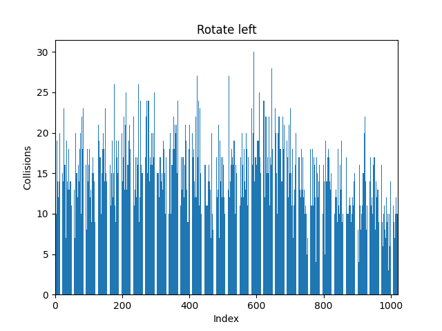
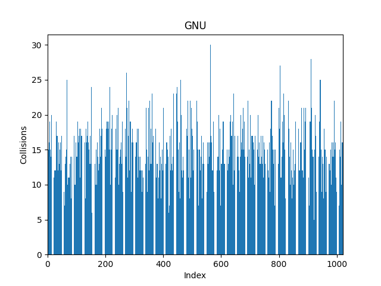

Количество слов в нашем эксперименте составило 6607 неповторяющихся слов.

# Отчёт по работе Хэш Таблицы

## Цель работы

## Введение

**Хэш-функция** - функция, преобразующая произвольный массив входных данных в битовую строку установленной длины. Подобное преобразование называется **хешированием**.

**Хэш-таблица** - структура данных, реализующая интерфейс ассоциативного массива (все элементы хранятся в виде пары ключ-значение). Она позволяет выполнять три операции: добавление новой пары, удаление пары и поиск пары по ключу.

*Зачастую она используется для словарей, где строка выступает в роли ключа.*

Существует два типа хэш-таблиц: со списками и с открытой адресацией. В первом случае таблица представляет из себя массив списков значений `H`, а во втором - просто массив значений `H`.

В дальнейшем будем рассматривать реализацию со списками. Так как она лучше подходит для работы со строками.

Выполнение каждой операции в хеш-таблице начинается с вычисления хеш-функции от ключа. Хеш-код `i = h(key)%sizeof(H)` ирает роль индекса в массиве `H`. В реализации со списками пара с таким хэшем попадает в список `H[i]`.

Существуют следующие характеристики хэш-таблиц:

**Заселённость**(Число коллизий) - это длина списка. В реализации хэш-таблицы с открытой адресацией данная характеристика не имеет смысла.

**Коэффициент заполнения(a)** - число элементов в хэш-таблице, делённое на её размер. Коэффициент заполнения определяет среднее время поиска по хэш-таблице. Для идеальной хэш-функции коэффициент заполнения соответствует количеству элементов в списке.

Хэш-таблица, которую мы в дальнейшем будет исследовать, будет иметь `a = 1,5` и число элементов порядка $10^4$.

## Инструменты и экспериментальная установка

Инструмент kachegrind.

## Ход работы

### Часть 1. Исследование хэш-функций

#### Задача

Изучить реализации различных хэш-функций. Сравить заселённость и дисперсию этих функций.  

#### Данные и эксперементальная модель

Трилогия Дж.Р.Р.Толкиена Властелин Колец в оригинале. Т.к. количество уникальных слов состовило `15410`, то для получения средней заселённости в `10-20` слов установим размер хэш-таблицы `1001`. 

##### Хэш-первый буква

Функция возвращает первый байт строки.

```C++
__uint32_t hash_first_letter(const char * string)
{
    return (__uint32_t)string[0];
}
```


##### Хэш-сумма

Функция возвращает сумму ASCII кодов символов.

```C++
__uint32_t hash_ascii_sum(const char * string)
{
    __uint32_t result = 0;
    int idx = 0;

    for(;string[idx] != '\0'; idx++)
        result += string[idx];

    return result;
}
```


##### ROR-хэш

Функция основана на алгоритме циклического сдвига вправо.

```C++
static inline __uint32_t ror(__uint32_t original, __uint32_t bits)  
{
    return (original >> bits) | (original << (32 - bits));

}

__uint32_t hash_rotate_right(const char *string)
{
    __uint32_t hash = 0;
    
    while(*string)
    {
        hash = ror(hash, 1)^*(string++);
    }

    return hash;
}
```

Заселённость хэш-таблицы с ROR-хэш:


##### ROL-хэш

Функция основана на алгоритме циклического сдвига влево.

```C++
static inline __uint32_t rol(__uint32_t original, __uint32_t bits)  
{
    return (original << bits) | (original >> (32 - bits));
}

__uint32_t hash_rotate_left(const char *string)
{
    __uint32_t hash = 0;
    
    while(*string)
    {
        hash = rol(hash, 1)^*(string++);
    }

    return hash;
}
```

Заселённость хэш-таблицы с ROR-хэш:



##### GNU-хэш

```C++
__uint32_t hash_gnu(const char *string)
{
    __uint32_t hash = 5381;         // стартовый размер таблицы

    int idx = 0;

    for(;string[idx] != '\0'; idx++)
        hash = ((hash << 5) + hash) + string[idx];

    return hash;
}
```

Заселённость хэш-таблицы с GNU хэш:



#### Результаты измерений


Если хэш функция хорошая, то количество пар с одинаковым хэключом может быть 


#### Простейший алгоритм

#### Оптимизированный алгоритм

#### Погрешности измерений

#### Измерения

### Часть 2. Alpha Blending

#### Теоретическая справка

#### Простейший алгоритм

#### Оптимизированный алгоритм

#### Погрешности измерений

#### Измерения

## Результаты

## Источники и литература